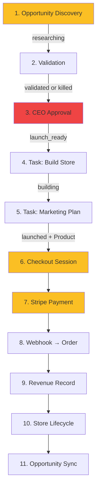

# Agent Store Launch Readiness Audit

**Phase 1.4 — AI Empire**  
**Date:** June 2026  
**Scope:** Audit and documentation only. No commerce or Stripe logic was modified.

---

## Executive Verdict

**Can an AI agent independently launch and operate a store from opportunity discovery through revenue collection?**

**No — not today.**

The platform has a well-structured domain pipeline with clear single sources of truth (SSOT) for status, revenue, and lifecycle sync. **Post-approval automation is partially built**: once an opportunity reaches `launch_ready`, the task worker can create a store record, create a product, and mark the opportunity `launched` without human intervention — **if** the worker is enabled and tasks execute successfully.

However, **four gaps block full agent autonomy**:

1. **Discovery is on-demand** — no scheduled Trend Hunter / opportunity generation in the worker.
2. **CEO approval is always manual** — no autonomous `validated` → `launch_ready` transition.
3. **There is no public storefront** — “store” is an internal database entity; checkout lives on the operator dashboard at `/stores/[id]`.
4. **Revenue collection requires external customer action** — Stripe Checkout is click-initiated; webhook ingestion is automated but not agent-driven.

**Bottom line:** An agent can **operate** much of the pipeline after human (or scripted API) CEO approval, and **revenue → lifecycle → opportunity sync** is fully automated. An agent cannot **independently discover, approve, publish, and collect revenue** end-to-end without human gates or infrastructure setup.

---

## End-to-End Workflow Trace



---

## Launch Readiness Matrix

| Step | Description | Automation | Entry Points | SSOT |
|------|-------------|------------|--------------|------|
| **1. Opportunity discovery** | Claude generates product opportunity | **Partial** — API/UI on demand; not scheduled | `POST /api/opportunities/generate`, `POST /api/agents/trend-hunter`, `generateOpportunityAction()` | `lib/opportunity/create-and-persist.ts` |
| **2. Validation** | Atlas validates researching opportunities | **Partial** — opt-in worker cycle or manual UI/API | `runValidatorCycle()`, `POST /api/validator/run-cycle`, `/validator` UI | `lib/opportunity/validate-opportunity.ts`, `lib/opportunity/status.ts` |
| **3. CEO approval** | Alpha approves validated → launch_ready | **Manual** | `/ceo` UI, `POST /api/opportunities/[id]/status` (`actor: "ceo"`) | `lib/opportunity/update-status.ts` |
| **4. Launch-ready effects** | Creates build + marketing tasks | **Fully automated** (on CEO approve) | `handleLaunchReadyEffects()` | `lib/opportunity/launch-ready-effects.ts` |
| **5. Store creation** | Forge creates/links Store record | **Partial** — automated via task worker; requires step 3 + worker | `executeBuildStoreTask()`, task worker / `POST /api/tasks/worker/tick` | `lib/store/link-opportunity.ts`, `lib/agents/execution/handlers/build-store.ts` |
| **6. Product creation** | Product from opportunity name + price | **Partial** — automated via marketing task after build | `executeMarketingPlanTask()`, `ensureProductForStore()` | `lib/store/ensure-product.ts`, `handlers/marketing-plan.ts` |
| **7. Storefront publishing** | Customer-facing store goes live | **Manual / Not implemented** | N/A — no Shopify, no public shop route | — |
| **8. Checkout** | Stripe Checkout Session | **Partial** — on-demand button or API; not agent-initiated | `POST /api/stores/[id]/checkout`, `StripeCheckoutButton` | `lib/commerce/create-stripe-checkout.ts` |
| **9. Payment** | Customer completes Stripe payment | **Manual** (customer action) | Stripe Hosted Checkout | Stripe |
| **10. Order ingestion** | Webhook processes completed session | **Fully automated** | `POST /api/webhooks/stripe` | `lib/commerce/process-stripe-checkout.ts`, `lib/commerce/record-order-revenue.ts` |
| **11. Revenue recording** | Revenue row + store.revenue increment | **Fully automated** (within order ingestion) | Called inside `recordOrderRevenue()` | `lib/store/record-revenue.ts` |
| **12. Store lifecycle** | launched → scaling → profitable | **Fully automated** on revenue | `syncStoreLifecycleFromRevenue()` | `lib/store/revenue-lifecycle.ts`, `lib/store/thresholds.ts` |
| **13. Opportunity sync** | Store status → opportunity status | **Fully automated** on revenue | `syncOpportunityFromStore()` | `lib/lifecycle/sync-opportunity-store.ts` |

### Automation legend

| Level | Meaning |
|-------|---------|
| **Fully automated** | Runs without human action once upstream preconditions are met |
| **Partially automated** | Code path exists but requires manual trigger, opt-in flag, human gate, or external action |
| **Manual** | Human or explicit operator action required every time |

---

## Blocker Analysis by Launch Capability

### Automatic store creation

| Status | Detail |
|--------|--------|
| **Partially blocked** | Store creation logic exists and works via `ensureStoreForOpportunity()` when the build-store task runs. |

**Blockers:**

- CEO must manually approve (`validated` → `launch_ready`) before tasks are created.
- Task worker disabled by default (`ENABLE_TASK_WORKER=false`).
- Direct store API deprecated (`POST /api/stores` → 410).
- Store is a **DB record only** — not an external commerce platform store.

**Unblocked when:** CEO approves + worker enabled (or tasks executed via API/UI).

---

### Automatic product creation

| Status | Detail |
|--------|--------|
| **Partially blocked** | Product created automatically when marketing-plan task completes during `building` status. |

**Blockers:**

- Product is **not** created during build-store — only after marketing task.
- Marketing task blocked until build-store completes (`lib/tasks/dependencies.ts`).
- Price parsed from `sellingPrice` string — fragile for ranges like `"$79 - $129"` (defaults to £29.99).
- Single product per store; no variants, inventory, or images.
- Supplier fields on Opportunity unused — no sourcing automation.

**Unblocked when:** Both tasks complete in order via worker or manual execution.

---

### Automatic storefront publishing

| Status | Detail |
|--------|--------|
| **Fully blocked** | No public storefront exists. |

**Blockers:**

- No `/shop/[storeId]` or customer-facing route.
- No Shopify, WooCommerce, or headless storefront integration.
- Checkout button only on internal operator page `/stores/[id]`.
- Marketing task outputs JSON plan text — does not publish ads, landing pages, or domains.
- `sourcing` status defined in transitions but has **no agent handler**.

**What “launched” means today:** Opportunity and store status flags flip to `launched` in the database. No external publication occurs.

---

### Automatic revenue collection

| Status | Detail |
|--------|--------|
| **Partially blocked** | Post-payment pipeline is fully automated; payment initiation is not. |

**Blockers:**

- Checkout requires human/customer to click “Pay with Stripe” or call checkout API.
- No agent-initiated checkout or payment link generation in worker cycle.
- Stripe webhook must be publicly reachable (`STRIPE_WEBHOOK_SECRET`, production `APP_URL`).
- GBP-only, first product only (`lib/commerce/create-stripe-checkout.ts`).
- No subscription/recurring, refunds, or dispute webhooks.

**Unblocked when:** Customer completes Stripe Checkout and webhook fires — order, revenue, lifecycle, and opportunity sync all run automatically with idempotency on `(source, externalId)`.

---

## Blockers Ranked by Impact

### Critical — prevents autonomous end-to-end launch

| ID | Blocker | Affected steps |
|----|---------|----------------|
| **C1** | **No autonomous CEO approval** — `validated` → `launch_ready` requires `actor: "ceo"`; no CEO worker cycle | 3, 4, 5, 6 |
| **C2** | **No public storefront** — customers cannot discover or buy without operator dashboard URL | 7, 8, 9 |
| **C3** | **Opportunity discovery not in worker** — Trend Hunter must be triggered manually or via external cron | 1 |

### High — prevents unattended operation

| ID | Blocker | Affected steps |
|----|---------|----------------|
| **H1** | **Task worker disabled by default** — `ENABLE_TASK_WORKER=false`; build + marketing tasks stall without cron/worker | 5, 6 |
| **H2** | **Validator automation opt-in** — `ENABLE_VALIDATOR_AUTOMATION=false` by default | 2 |
| **H3** | **Production infrastructure not live** — requires Railway deploy, PostgreSQL, env vars (`EMPIRE_API_KEY`, `APP_URL`) | All |
| **H4** | **Stripe webhook dependency** — revenue pipeline inactive until public webhook configured | 10–13 |

### Medium — reduces reliability or quality

| ID | Blocker | Affected steps |
|----|---------|----------------|
| **M1** | **`meetsLaunchReadyCriteria()` unused** — CEO can approve sub-threshold opportunities; launch_ready never auto-assigned | 3 |
| **M2** | **Price parsing fragility** — `parseSellingPrice()` can misparse range strings | 6, 8 |
| **M3** | **Marketing task is plan-only** — no ad campaign, content, or traffic generation | 7 |
| **M4** | **`sourcing` stage unimplemented** — no supplier agent or automation | 5–7 |
| **M5** | **Single-product stores** — no catalog, upsells, or bundles | 6, 8 |

### Low — future scale / ops

| ID | Blocker | Affected steps |
|----|---------|----------------|
| **L1** | **No expense/profit-based lifecycle** — scaling/profitable driven by gross revenue only | 12 |
| **L2** | **No autonomous kill logic** — underperforming stores not auto-killed | 12, 13 |
| **L3** | **Manual revenue path** — `POST /api/revenue` bypasses order/customer records | 11 |
| **L4** | **Lifecycle reconciliation periodic** — runs on worker intelligence refresh, not every request | 13 |
| **L5** | **Legacy worker deprecated** — `worker.ts` exits immediately; use `task-worker.ts` | 5, 6 |

---

## What Works Today (Verified Paths)

These steps are **production-ready in code** and were verified in Lean 8B/8C testing:

```
Stripe Checkout → checkout.session.completed webhook
  → processStripeCheckoutSession()
  → recordOrderRevenue()
  → recordStoreRevenueTx()
  → syncStoreLifecycleFromRevenue()
  → syncOpportunityFromStore()
```

Revenue thresholds (SSOT `lib/store/thresholds.ts`):

- ≥ £1,000 cumulative → store `scaling`
- ≥ £5,000 cumulative → store `profitable`

Opportunity sync is upgrade-only — never downgrades from store state.

Task execution order is enforced: build-store before marketing-plan.

---

## Minimum Work Before First Public Launch

“First public launch” here means: **a real customer can pay money and the empire records order + revenue + lifecycle automatically on production infrastructure** — not full agent autonomy.

### Required (minimum viable launch)

| # | Work item | Resolves |
|---|-----------|----------|
| 1 | **Deploy to Railway** with PostgreSQL per `DEPLOYMENT_PRODUCTION.md` | H3 |
| 2 | **Set production env vars** — `EMPIRE_API_KEY`, `ANTHROPIC_API_KEY`, `APP_URL`, Stripe keys | H3, H4 |
| 3 | **Configure Stripe live webhook** → `/api/webhooks/stripe` | H4 |
| 4 | **Enable task worker** — `ENABLE_TASK_WORKER=true` on Railway worker service or cron `POST /api/tasks/worker/tick` | H1 |
| 5 | **Manual CEO approval** for at least one validated opportunity (until C1 is built) | C1 |
| 6 | **Verify task chain completes** — build-store → marketing-plan → product exists | 5, 6 |
| 7 | **Share checkout URL** — `https://your-domain/stores/{id}` (interim; no real storefront yet) | C2 (partial) |
| 8 | **Smoke test** — live payment → confirm order, revenue, lifecycle, opportunity sync | 10–13 |

### Not required for first payment (defer)

- Autonomous CEO agent (C1)
- Scheduled Trend Hunter (C3)
- Shopify / public storefront (C2)
- Supplier/sourcing automation (M4)
- Marketing campaign execution (M3)

### Recommended before scaling beyond one store

- Auto-CEO cycle for opportunities meeting `meetsLaunchReadyCriteria()`
- Scheduled opportunity generation in worker
- Public customer-facing shop route or Shopify integration
- PostgreSQL migration verification (`npm run db:verify-postgres`)

---

## Agent Autonomy Scorecard

| Capability | Ready? | Notes |
|------------|--------|-------|
| Discover opportunities | ❌ | On-demand only |
| Validate opportunities | ⚠️ | With `ENABLE_VALIDATOR_AUTOMATION=true` |
| Approve for launch | ❌ | CEO manual gate |
| Create store record | ⚠️ | After approval + worker |
| Create product | ⚠️ | After both tasks |
| Publish storefront | ❌ | Not implemented |
| Initiate checkout | ❌ | Customer/operator click |
| Collect payment | ⚠️ | Automated after Stripe payment |
| Record revenue | ✅ | Fully automated |
| Promote lifecycle | ✅ | Fully automated |
| Sync opportunity | ✅ | Fully automated |

**Score: 3/11 fully ready · 4/11 partial · 4/11 blocked**

---

## Reference — Canonical File Map

| Concern | File |
|---------|------|
| Opportunity creation | `lib/opportunity/create-and-persist.ts` |
| Status thresholds | `lib/opportunity/thresholds.ts` |
| Status transitions | `lib/opportunity/transitions.ts`, `lib/opportunity/update-status.ts` |
| Launch-ready criteria (hints only) | `lib/opportunity/status.ts` → `meetsLaunchReadyCriteria()` |
| Validator automation | `lib/opportunity/validator-cycle.ts` |
| Launch-ready task creation | `lib/opportunity/launch-ready-effects.ts` |
| Store creation | `lib/store/link-opportunity.ts`, `lib/agents/execution/handlers/build-store.ts` |
| Product creation | `lib/store/ensure-product.ts`, `lib/agents/execution/handlers/marketing-plan.ts` |
| Task ordering / deps | `lib/tasks/dependencies.ts` |
| Worker orchestration | `task-worker.ts`, `lib/agents/execution/empire-worker-cycle.ts` |
| Stripe checkout | `lib/commerce/create-stripe-checkout.ts` |
| Order ingestion | `lib/commerce/record-order-revenue.ts`, `app/api/webhooks/stripe/route.ts` |
| Revenue | `lib/store/record-revenue.ts` |
| Store lifecycle | `lib/store/revenue-lifecycle.ts` |
| Opportunity sync | `lib/lifecycle/sync-opportunity-store.ts` |
| CEO queue | `lib/queries/ceo/get-ceo-queue.ts` |

---

## Related Documentation

| Document | Purpose |
|----------|---------|
| `DEPLOYMENT_PRODUCTION.md` | Railway production deploy |
| `DEPLOYMENT.md` | Security model, API auth, Stripe setup |
| `docs/POSTGRESQL_MIGRATION_PLAN.md` | SQLite → PostgreSQL |
| `/readiness` | Live production diagnostics |

---

## Conclusion

AI Empire has a **solid automated revenue and lifecycle engine** once a store is launched and a payment occurs. The **autonomy gap is front-loaded**: discovery, validation scheduling, CEO approval, storefront publishing, and payment initiation all require human or external triggers.

**Recommended next phase (post-audit, not in scope here):**

1. **Auto-CEO cycle** — approve `validated` opportunities meeting `meetsLaunchReadyCriteria()` without human click.
2. **Scheduled Trend Hunter** — add opportunity generation to `runEmpireWorkerCycle()`.
3. **Public shop route** — minimal customer-facing product page with embedded Stripe Checkout.
4. **Agent checkout initiation** — worker generates payment links after product creation.

Until items 1–3 are addressed, position the platform as **AI-assisted ecommerce operations** with automated post-payment intelligence — not fully autonomous store launching.
